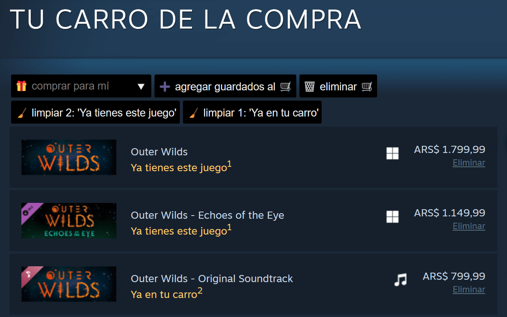

  

<h1 align="center"> SCH - Steam Cart Helper</h1>

  
  

## Índice

- [📝 Índice](#índice)
- [ℹ️ Descripción](#descripción)
- [👀 Capturas de Pantalla](#capturas-de-pantalla)
- [🧑‍💻 Contribuye programando](#contribuye-programando)

## Descripción

  🛒 Extensión para navegadores que te ayuda a ahorrar tiempo agregando funcionalidades al carrito de compras de Steam
   
  <h3>Features</h3>
  <ul>
    <li>Guardar y administrar juegos en una lista de compras.</li>
    <li>Adaptar el carrito omitiendo los juegos que ya tengas.</li>
    <li>Adaptar el carrito para regalar juegos a un amigo (omitiendo los juegos que ya tenga).</li>
    <li>Limpiar el carrito quitando productos redundantes.</li>
  </ul>

## Capturas de Pantalla

  
  

## Contribuye programando

🧑‍💻 El proyecto acepta contribuciones, por lo que siéntete libre de hacer un [Forck](https://github.com/JLCareglio/Steam-Cart-Helper-Browser-Extension/fork) al mismo para poder modificarlo aportando solución a errores o nuevas características.
